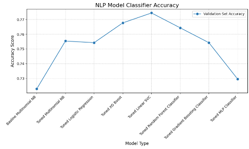
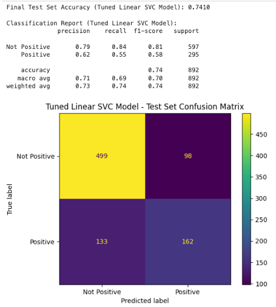

# Automating Tweet Sentiment Classification via Natural Language Processing (NLP)

Author: Andrew Reusche

## Project Summary 
#### Business and Data Understanding
My project aims to cut down the time our marketing team spends manually searching for positive product tweets by automating sentiment classification with Machine Learning and Natural Language Processing. To train my model, I will be using a dataset containing roughly 9,000 real tweets, where each tweet has already been classified as having a “Positive” (2,970 instances) or "Neutral/Negative" (6,100 instances) sentiment. This sentiment-rich text data is well-suited for NLP and is reflective of real customer opinions, enabling my team to engage with the tweets effectively.

#### Data Preparation
Tweets can be messy, containing hashtags, links, and other text that doesn’t directly convey sentiment. To help strip these tweets of unnecessary data, I experimented with Regular Expressions to clean the text, Stop Words to get rid of unnecessary words, N-Grams to string together multiple words for enhanced meaning, and TF-IDF Vectorization to filter out rare/ overly common words and convert the text into numerical features that our classification models can interpret.

#### Modeling
I used libraries like SKLearn and XG-Boost for modeling and testing classifiers, including Multinomial Naive Bayes, Logistic Regression, XG Boost, Linear SVC, Random Forest, Gradient Boosting, and MLP Classifier. Each model was trained and tuned on training and validation data subsets, with five-fold hyperparameter GridSearchCVs optimized to maximize accuracy.

#### Evaluation
I ended up using a tuned Linear SVC on a testing data holdout to simulate the model’s effectiveness on new tweets, and the model performed fairly well with an accuracy of 74.1% (correctly classifying 661 out of 892 tweets). However, its recall and precision for the “Positive” class were 55% and 62%, indicating that a sizable amount of “Positive” tweets were missed, and not “Positive” tweets were included.  This model can successfully decrease the amount of time our marketing team needs to spend sifting through tweets but is not yet good enough to fully eliminate human oversight of sentiment classification.

## Business Problem

Can tweets be automatically analyzed to extract emotional sentiment?

Our marketing company has been hired by a tech firm to come up with new marketing ideas about the products they represent. The tech firm would like to see if tweets about their products can be used in a useful manner to help their business grow. To help achieve this, our company will be analyzing recent tweets about these tech lines (Google and Apple) in an attempt to extract insights on how and what people are currently feeling about these products.

My team has specifically been tasked with finding tweets where people have been talking about these products in a positive light. Once the positive sentiment tweets are separated from the others, they will be sent over to the marketing team, where they can be analyzed further in an attempt to extract new marketing strategies.

Up until now, our marketing team has been individually reading tweets about these products and manually classifying their emotional sentiment one at a time. The process of manually doing this is very time-consuming, mind-numbing, and costly for our marketing company. To free up our marketing team's time and resources, I will create a model that automatically classifies the emotional sentiment of the tweets. This will significantly reduce the amount of time the marketing department has to spend sifting through tweets to find ones with positive emotional sentiment.

### Metric of Success

In this case, the marketing team has stated that it is just as important to minimize the amount of tweets falsely categorized as positive as it is to minimize the amount of tweets falsely categorized as negative. In other words, they would like to miss out on as few potential new marketing angles as possible without wasting too much time accidentally pursuing topics that people actually dislike. Being that minimizing false positives (precision) is just as important as minimizing false negatives (recall), we will use accuracy as the metric of success since it gives us a score of the overall correctly classified tweets.

### Data Source and Data Use:

Source: "Brands and Product Emotions" Data World, CrowdFlower, 2016, https://data.world/crowdflower/brands-and-product-emotions

To simulate a corpus of tweets the marketing team has compiled for sentiment analysis, I will be using the "Brands and Product Emotions" dataset from CrowdFlower's Data World repository (cited above). 

This dataset contains almost 9,100 real tweets centered around various Apple/Google products, and marked for emotional sentiment. These tweets have already been presented to people for manual classification into one (1) of four (4) emotional sentiment categories:

    1) No Emotion toward brand or product
    2) Positive Emotion
    3) Negative Emotion
    4) I can't tell

I will be using the Tweet column to try to predict the Emotion class column, and more specifically, which tweets carry a positive emotion or sentiment. After all the "I can't tell" instances are dropped, the Emotion column will be manipulated to create a new column called Sentiment that will tell us if each tweet has a positive sentiment (denoted by 1) or does not have a positive sentiment (denoted by 0), enabling us to use a One-Vs-All classification.

I will use Natural Language Processing (NLP) to clean, tokenize, and manipulate each tweet so that the maximum amount of useful information can be extracted from each one in an attempt to predict sentiment classification. 

### Data Preprocessing 

Currently, these tweets are in raw form and contain a lot of unstructured or useless text (usernames, hashtags, links, other special characters) that does not directly relate to the sentiment of the overall tweet. To help my models more accurately predict the sentiment of these tweets, and avoid the garbage in garbage-in-garbage-out trope, we will be stripping these tweets down to their most useful informative tokens for NLP analysis while trying to preserve the maximum amount of sentiment-relevant content.

## Model Building and Data Analysis

Now that my tweets have been cleaned and preprocessed, I am ready to vectorize them and put them through classification models to see if Positive Sentiment tweets can be automatically and accurately categorized without the need for constant human oversight. I will be pairing TF-IDF Vectorization with different Machine Learning Classification models to maximize the accuracy of this sentiment classification. I will specifically be training these models on the X_train data, and tuning their hyperparameters on the X_val data to see how well it generalize to unseen tweets.

The Tuned Linear SVC achieves the highest validation accuracy ~0.774, outperforming all other models, including Tuned XG Boost ~0.767, Tuned Random Forest Classifier ~0.764, Tuned Gradient Boosting Classifier ~0.754, and Tuned MLP Classifier ~0.73. The Baseline Multinomial NB and Tuned MLP Classifier have the lowest accuracies ~0.73.

I will run the optimized TF-IDF Vectorization and Linear SVC model on the holdout data to simulate how it will perform on new tweets that our marketing team will feed into it.

## Conclusions

My conclusion from this analysis is that our marketing team could use binary classification via supervised machine learning to implement an automated process for identifying positive sentiment tweets, reducing the need for manual review and potentially improving their efficiency in monitoring how customers are feeling about specific products like iphones and ipads on Twitter.

In this specific use case, the Tuned Linear SVC classification model can be used to analyze tweets in real-time or in batches as they are collected from Twitter. If the classifier determines a tweet expresses positive sentiment, it can flag the tweet for the marketing team to review for potential marketing opportunities, such as responding to positive feedback or sharing it in promotional materials.

Since accuracy was the requested optimized metric for success, with precision and recall as secondary considerations to balance the trade-off between identifying positive tweets and minimizing errors, we can highlight the following three (3) factors:

1) High Overall Accuracy for Reliable Automation: Given this model’s accuracy rating of 74.10% on the test set data, we can say that the Tuned Linear SVC is moderately reliable at correctly classifying the sentiment of tweets as either "Positive" or "Not Positive." This means that 74.1% of the time, the model accurately identifies the sentiment of a tweet, allowing the marketing team to automate the initial filtering process and focus their efforts on a smaller subset of tweets. While this accuracy is not as high as desired for full automation, it still significantly reduces the manual workload by correctly classifying 661 out of 892 tweets, saving the team from reviewing all tweets by hand.

2) Moderate Precision for Positive Sentiment Identification: Given this model’s precision rating of 62% for the "Positive" class on the test set data, we can say that when the model predicts a tweet to be positive, there is a moderate likelihood that it actually expresses positive sentiment. This means that out of all the tweets the model flags as "Positive," 38% are actually "Not Positive" (98 out of 260 predicted positives). For the marketing team, this implies that while the model helps narrow down the pool of tweets to review (from 892 to 260), they will still need to manually verify the flagged tweets to filter out the 38% false positives. However, this is a manageable trade-off, as it significantly reduces the number of tweets requiring manual review.

3) Moderate Recall for Capturing Positive Sentiment: Given this model’s recall rating of 55% for the "Positive" class on the test set data, we can say that the model is decent at identifying positive tweets but misses a significant portion. This means that out of all the tweets that are actually positive, the model correctly classifies 55% of them (162 out of 295), while 45% (133 tweets) are incorrectly classified as "Not Positive." For the marketing team, this indicates that while the model captures over half of the positive tweets, they may miss nearly half of the opportunities to engage with positive sentiment unless they manually review the "Not Positive" predictions. To address this, the team could implement a secondary manual review process for the 632 tweets predicted as "Not Positive," focusing on the 133 missed positives, which still reduces the overall manual effort compared to reviewing all tweets.

To deal with these lower precision and recal scores, we could go back and change the metric for success to a hybrid between accuracy and precision. By putting precision at a higher priority, it could decrease the amount of "Not Positive" tweets falsely classified as "Positive" potentially leading to a fully automated process instead of just decreasing the amount of tweets our marketing team needs to review. Doing this could also decrease the recall of the model, leading to more undiscovered "Positive" tweets falling through the cracks. Alternatively prioritizing Recall over precision could have the opposite effect where more "Positive" sentiment tweets are sucked up, decreasing the amount that are missed, but with that more false "Positive" tweets may be sucked up as well.

## Next Steps

Here are three potential next steps our company can implement to further assist our marketing team.

1) Instead of searching for "Positive" sentiment, we could search for "Negative" sentiment. These tweets could then be used to put together a profile on how these products and services could be improved in future iterations.

2) Instead of having our marketing team manually pull down tweets for analysis one by one, I could set up an API that automatically pulls down tweets and classifies their sentiment, further decreasing the amount of manual work our marketing team has to do.

3) Perform unsupervised clustering on "Positive" predictions to create feedback segmentation that can be used to group together common areas of discussion about different aspects of these products. These tweet clusters can then be presented to the marketing team for targeted analysis of current product features.

## Repository Links

PowerPoint presentation

Notebook PDF

Project Notebook

## Repository Layout
1) Pictures
2) GitIgnore File
3) Notebook PDF
4) Project Notebook
5) Project PowerPoint Presentation
6) README file